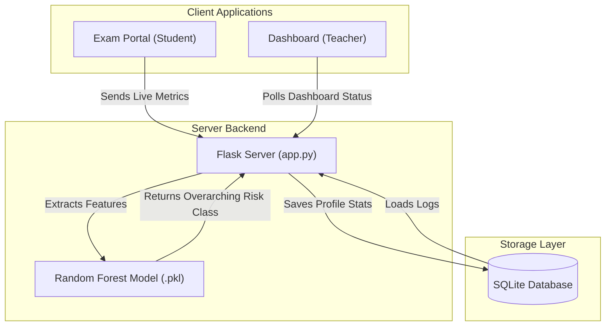
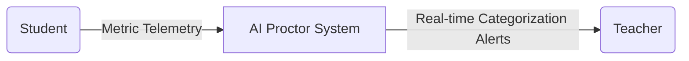
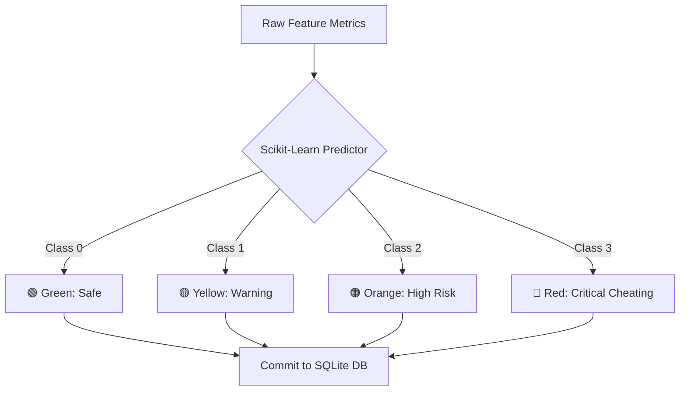
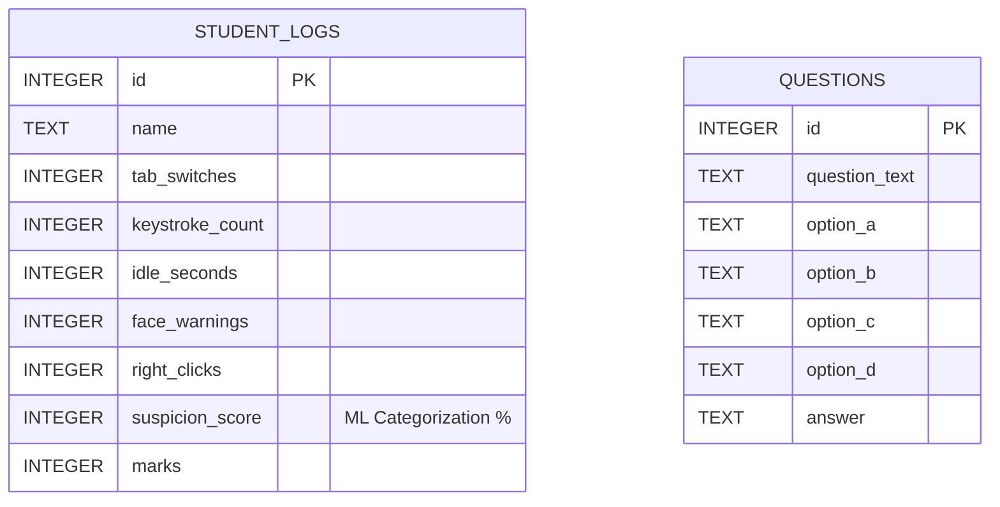
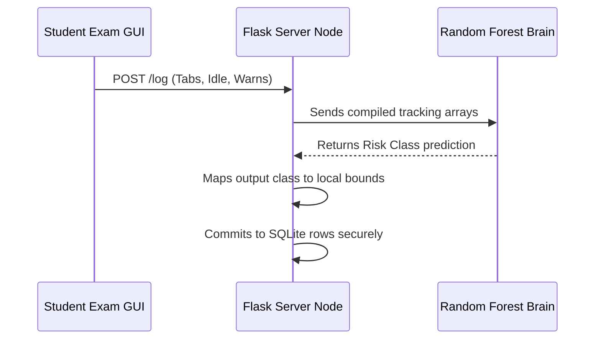
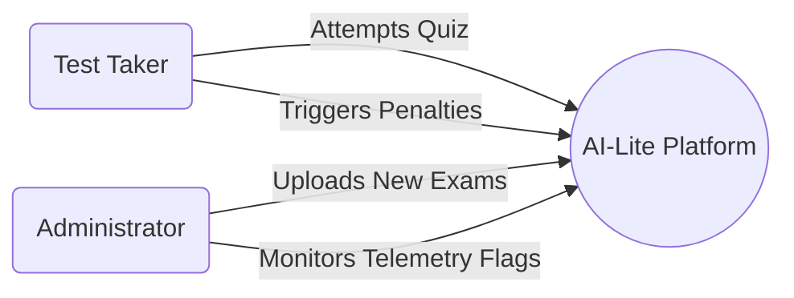
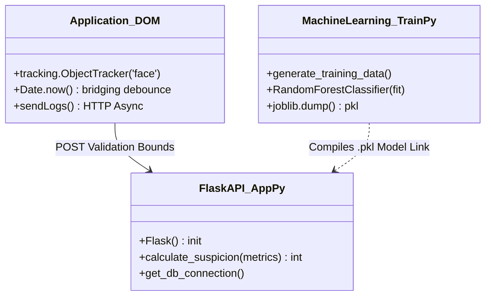
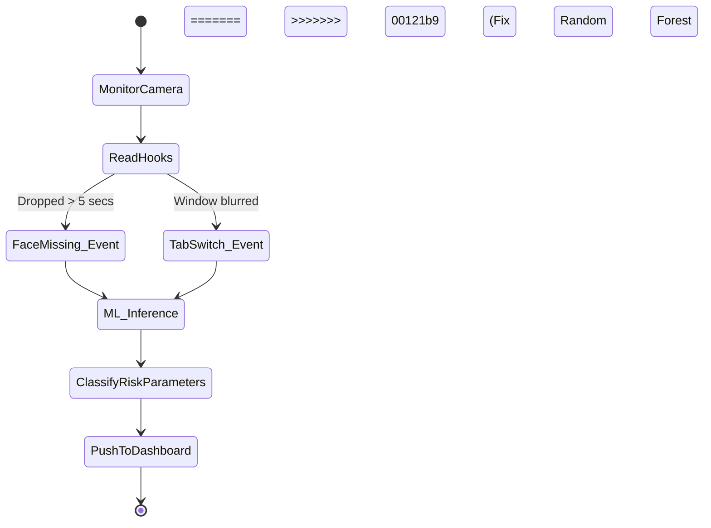
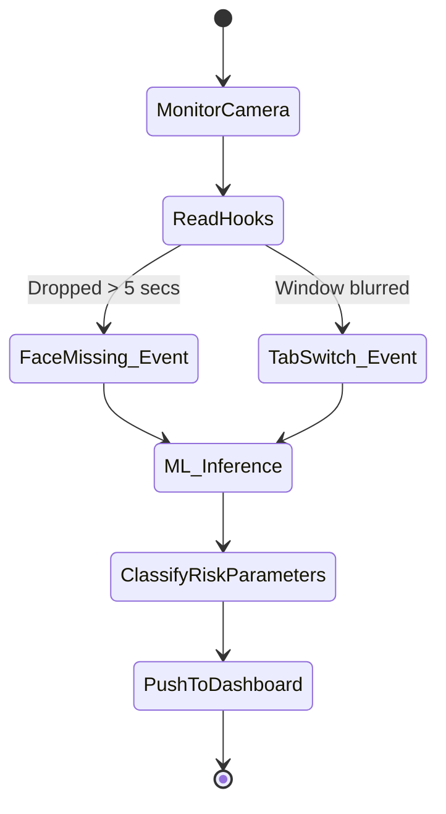

# AI-Lite Proctoring System - Technical Documentation 

This document serves as the high-level technical breakdown, outlining the system's absolute structure, the utility of individually built files, and comprehensive visual diagrams (via Mermaid) detailing exactly how data routing behaves through the architecture.

---

## 📁 Directory Structure & File Index

```text
ai-exam-proctor/
│
├── app.py                      # Core Python Flask Server hooking API routing and ML inference handling.
├── init_db.py                  # Database bootstrapper to generate clean SQL schemas and mock quiz data.
├── train_model.py              # Generates synthetic CSV tracking data and compiles explicitly trained Scikit-Learn Models.
├── proctor_ml_model.pkl        # The compiled Random Forest Machine Learning artifact.
├── database.db                 # The SQLite persistent storage for tracking student violations and test questions.
├── behavior_logs.csv           # A synthetic dataset mapping millions of mocked behaviors to train the AI.
├── README.md                   # Basic setup command guide specifically for non-coders.
├── project.md                  # This high-level technical diagram sheet mapping explicit components.
│
└── templates/
    ├── exam.html               # Frontend Student Application rendering Haar Cascade Face Tracking securely over the webcam.
    └── admin.html              # Frontend Administrative Dashboard mapping live ML-ranked color flags for teachers tracking examinees.
```

### File Purposes:
1. **`app.py`**: The central brain. Serves HTML web templates, safely handles frontend REST API posts (`/api/log`, `/api/submit`), natively loads the `.pkl` file into memory, runs live data against the Random Forest predictor, and commits tracking results to the persistent DB.
2. **`init_db.py`**: Provides reproducible startup environments. Used by first-time users to organically populate database columns, format a list of standardized test questions, and flush historical tables locally.
3. **`train_model.py`**: The Data Science script. Mocks varying degrees of human cheating (tab switching heavily, failing to look at the screen, etc.) and runs them through a robust Decision Tree constraint array via Random Forest, mapping it explicitly into 4 distinct threshold classes (from Green/Safe to Red/Critical) before saving the finalized `pkl` file.
4. **`templates/exam.html`**: The test-taker Javascript interface. Blocks keyboard shortcuts natively via DOM `event.preventDefault()`, maps a transparent Canvas explicitly over the live local WebCam via local `tracking.js` for facial bounding box locking, and transmits health-status API telemetry chunks. 
5. **`templates/admin.html`**: The oversight leaderboard. Natively auto-polls the DB every ~3000ms picking up updated Machine Learning risks. If `app.py` flags a student class heavily, the javascript here natively applies explicit CSS bounding colors so a human Proctor can immediately spot an irregularity.

---

# 1. 🏛️ High-Level System Architecture
"The 10,000-foot view of how the system works."

We utilize a **Flask-based API architecture** closely integrated with a **Machine Learning inference engine**. The system is layered to securely separate the real-time client UI tracking, backend logic, and centralized SQLite data storage.

🎨 **Architecture Diagram**



🗣️ **Presentation Talking Points:**
* "The user interacts with a clean web interface tracking face bounds natively using Haar Cascades inside the browser."
* "The heart of the system is the Random Forest ML module, which acts as the 'Proctoring Brain' analyzing behavior dynamically."
* "The database securely stores lightweight telemetry logs—tab switches, idle time, and ML categorizations—keeping the system extremely fast and preserving privacy!"

---

# 2. 🔄 Data Flow Diagrams (DFD)
"How data moves through the system."

### Level 0: The Context (The Big Picture)
*Simple Input/Output flow.*



### Level 1: Detailed Process Flow
*What happens inside the "Logic Engine"?*



---

# 3. 🗂️ Database Design (ER Diagram)
"How we structure the data."

We use a flat, efficient schema optimized for fast lookups and high-concurrency API polling scaling.



🗣️ **Presentation Talking Point:** 
"Notice the `suspicion_score` integer field. This is what allows us to natively interface the Python Machine Learning predictions directly with the HTML front-end to dynamically generate the live color-coded Leaderboard."

---

# 4. 📐 UML Diagrams
"The formal blueprints of the software."

### A. Sequence Diagram
"The timeline of a verification request."



### B. Use Case Diagram
"Who does what?"



### C. Class Diagram
"The code structure."



### D. Activity Diagram
"The logic flow for classifying threats."



### D. Activity Diagram
"The logic flow for classifying threats."


